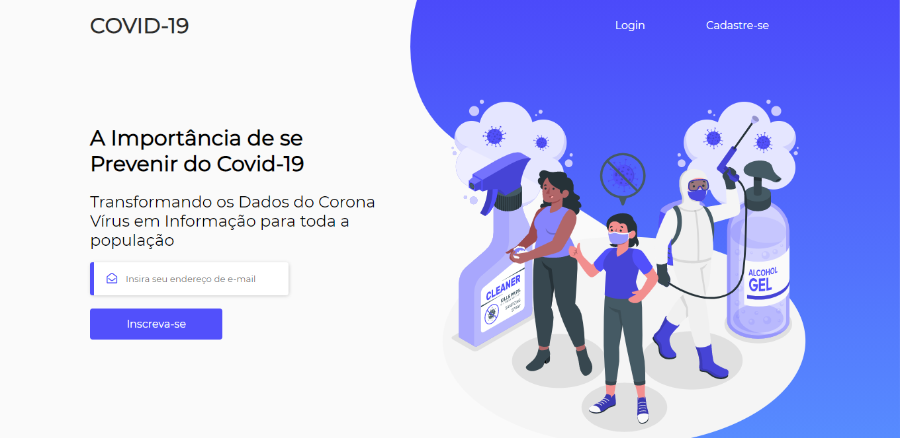
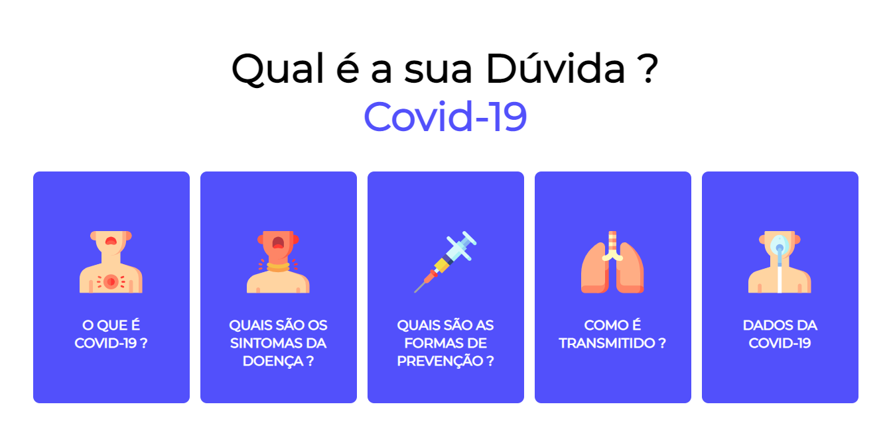
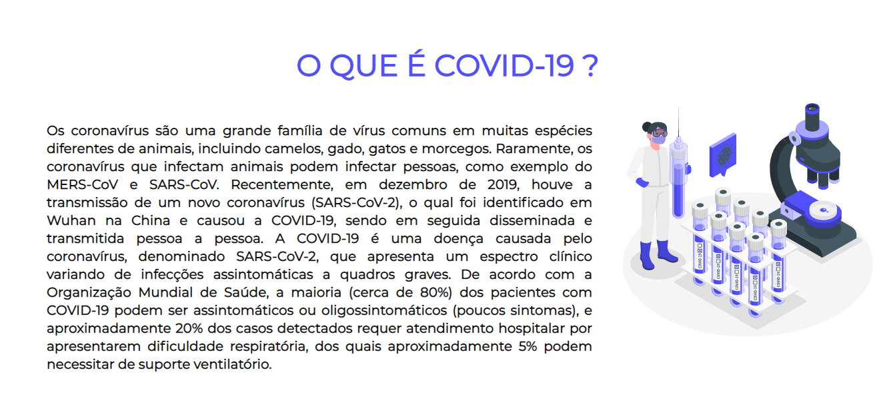
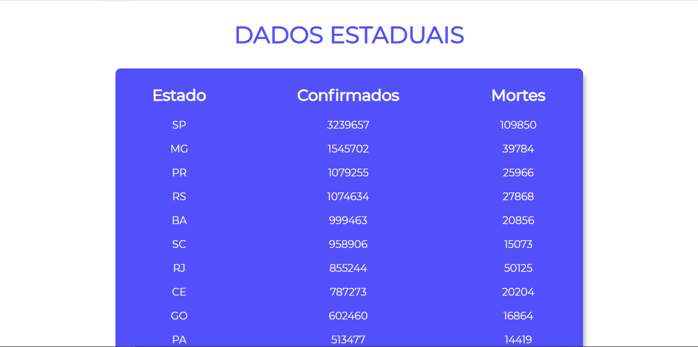
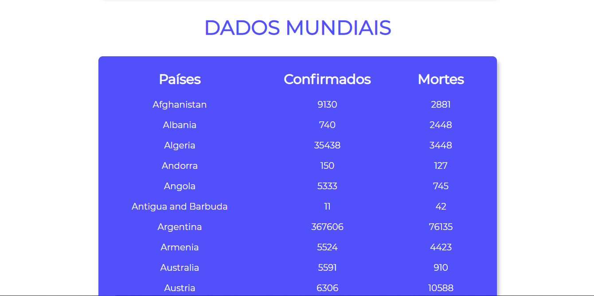

# COVID-19

## About the project

---

Covid-19 is a web application with the purpose of solve the problem with Fake News. Basically, the application is fetching an API with Data about deaths around the world. However, there are others informations present around the application to combat the fake news. For example, a topic about COVID-19, what are the symptoms and other things.

## Images

## Getting Started

---

    # Install dependencies
    $ npm install
    # Start Project
    $ npm start
    # Initialize server
    $ node server.js
    # You can see the application on localhost link http://localhost:1501/

## Technologies

---

- [Node.js](https://nodejs.org/)
- [Express](https://expressjs.com/)
- [SQLite3](https://www.sqlite.org/index.html)
- [HTML](https://developer.mozilla.org/en-US/docs/Web/HTML)
- [CSS](https://developer.mozilla.org/en-US/docs/Web/CSS)
- [JavaScript](https://developer.mozilla.org/en-US/docs/Web/JavaScript)
- [Sass](https://sass-lang.com/)

## Next Step

---

Build a map of COVID around the world and try to set a graph that shows the evolution of the virus.

## License & Copyright

---

Licensed under the [MIT License](LICENSE)
